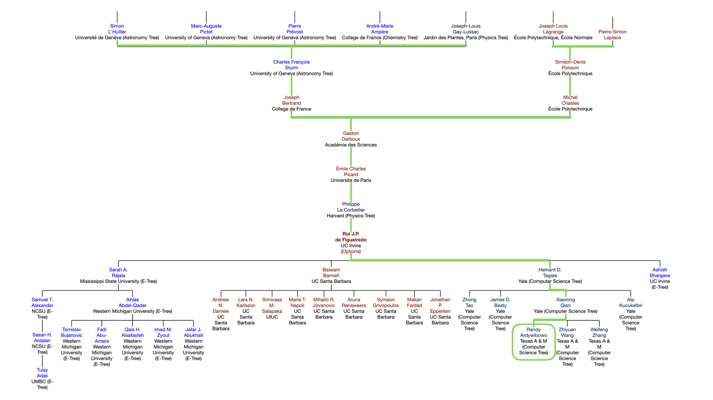

+++
title = "Academic Tree"
subtitle = ""
date = "2025-01-24T00:00:00.000Z"
summary = ""
draft = false
featured = false
authors = ["admin"]
tags = ["blog"]
categories = []
projects = []
images = ["tree.png"]
+++

An academic family tree is a diagram that shows the relationships between researchers and their advisors. It is a way to visualize the academic lineage of a researcher and to see how ideas have been passed down through generations. I find it amazing that many modern researchers can trace their academic lineage to great scientists from the past. I think it's a great way to pay homage to the people who have come before us and to show how ideas are built on top of each other. I also think it's a great way to show how we are all connected in some way. You can see my academic tree above. Among other great figures, some of my academic ancestors include:

- **Gaston Darboux** (1842–1917): a French mathematician renowned for his contributions to differential geometry, particularly the Darboux theorem and the Darboux integral, which significantly advanced the understanding of surfaces and transformations in geometry.

- **Simeon-Denis Poisson** (1781–1840): a French mathematician and physicist whose work on probability theory, mechanics, and electromagnetism left a lasting legacy, notably through Poisson's equation and Poisson distribution.

- **Pierre-Simon Laplace** (1749–1827): a French mathematician and astronomer best known for his pioneering work in celestial mechanics and probability theory, as well as formulating the Laplace equation and Laplace transform.

- **Joseph Louis Lagrange** (1736–1813): an Italian-born mathematician and physicist who made monumental contributions to calculus, mechanics, and number theory, including the formulation of Lagrangian mechanics and Lagrange multipliers.

- **Andre-Marie Ampere** (1775–1836): a French physicist and mathematician who founded the science of electrodynamics (now electromagnetism), with his name immortalized in the unit of electric current, the ampere.

- **Joseph-Louis Gay-Lussac** (1778–1850): a French chemist and physicist celebrated for his work on gas laws, chemical analysis, and the discovery of the relationship between gas pressure and temperature, known as Gay-Lussac's law.
