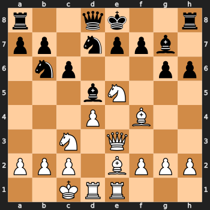
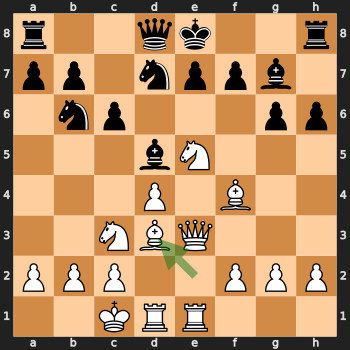
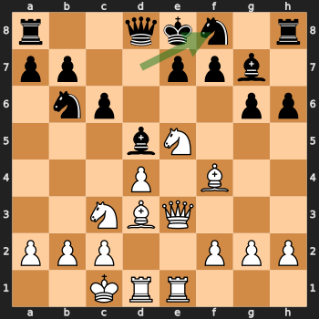

+++
title = "Emergence of Reasoning in Language Models Trained on Chess"
subtitle = ""
date = "2025-02-17T00:00:00.000Z"
summary = ""
draft = false
featured = false
authors = ["admin"]
tags = ["blog"]
categories = []
projects = []
images = ["state1.png", "state2.png", "state3.png"]
+++


Recent advances in neural networks have demonstrated superhuman performance in chess, yet these successes have traditionally relied on an auxiliary search mechanism—such as Monte Carlo Tree Search (MCTS)—to provide the “System 2” reasoning that complements the neural network’s rapid “System 1” responses. Recently, however, reinforcement learning techniques have enabled large language models (LLMs) to perform complex reasoning without the need for explicit external search processes. This development raises a fundamental question: *What are the limitations of this training paradigm?*

One promising approach to addressing this question is to evaluate LLM-based reasoners within the domain of chess. Chess offers several advantages as a benchmark for language model capabilities:

- **Text Representations**: Chess board configurations can be succinctly encoded in text, allowing language models to both interpret and generate moves within this familiar format.

- **Reward Structure**: The rewards in chess are well-defined, and performance can be reliably measured against established human benchmarks.

- **Zero-sum Game**: As a zero-sum game with a well-defined Nash equilibrium, chess is inherently suited for self-play training regimes, with no fundamental need for human data.

- **Outsized Performance from Search and Reasoning**: Prior work has demonstrated that even minimal integration of search techniques, such as MCTS, can yield significant performance gains, suggesting that subtle reasoning enhancements might be sufficient.

Within this framework, several open research questions emerge:

- **Limits of In-Context Reasoning**: Can LLMs, relying solely on in-context reasoning, achieve or even surpass the performance of systems that integrate hand-crafted MCTS strategies?

- **Scaling Laws for Inference-Time Computation**: How does the allocation of compute at inference time correlate with improvements in Elo rating? Furthermore, what is the trade-off between training-time and inference-time computational resources, and how can we characterize this relationship on a Pareto frontier?

- **Interpretability of Reasoning Traces**: Given that chess can be learned entirely from scratch without human language priors through self-play, what insights can be gained by analyzing the internal reasoning traces of these models? Are these traces interpretable in a manner that advances our understanding of machine reasoning?

By exploring these questions, we can delineate the capabilities and inherent constraints of LLM-based reasoning systems. Chess, with its structured environment and quantifiable outcomes, provides a rigorous testbed for understanding how large language models can autonomously navigate complex decision-making processes.

## Preliminary Results

### Methodology

We finetuned Llama3.2-1B using reinforcement learning. The setup is as follows:

- We perform constrained decoding rollouts, ensuring that the model only considers legal moves, and follows the following format:

```
...
<think> 
[Reasoning Monologue]
</think> 
[Move, e.g. 1. e4]
<think> 
[Reasoning Monologue]
</think> 
[Move, e.g. 1. ...e5]
<think> 
[Reasoning Monologue]
</think>
...
```

- We trained the model using PPO, allowing us to learn on unfinished games and evaluate the model’s performance at any point during the game.

### Results

The resulting model exhibits reasoning traces that emerge simply from the training process. The following is an example of a reasoning monologue generated by the model and its corresponding moves in a given board state:

```
...
<think> 
White develops the other bishop to d3, reinforcing central control and preparing to support an eventual kingside advance. Alternatives like Rd1 were considered, but Bd3 develops a new piece with an eye on Black’s weaknesses. 
</think> 
13. Bd3 
<think> 
Retreating the knight to f8, Black looks to reorganize its forces—possibly rerouting to g6 or e6 later—to better support the kingside. Keeping the knight on d7 might expose it to tactics, so Nf8 is more defensive. 
</think> 
13... Nf8 
<think>
...
```

<!-- <div style="display: flex; justify-content: center; gap: 20px;">
    
    
    
</div> -->

We are currently analyzing its performance, as well as training a model from scratch to measure its scaling laws. Additional results will be published soon.
